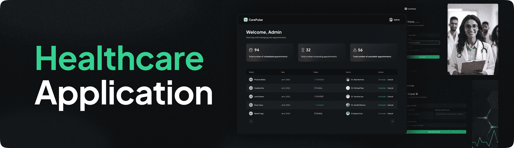

<div align="center">
  <a href="">
    
  </a>
</div>

<h3 align="center">🚀 CarePulse - Your Ultimate HealthCare Management System</h3>

## 📋 <a name="table">Table of Contents</a>

1. 🤖 [Introduction](#introduction)
2. ⚙️ [Tech Stack](#tech-stack)
3. 🔋 [Features](#features)
4. 🛠️ [Quick Start](#quick-start)
5. 💡 [Contributing](#contributing)

## <a name="introduction">🤖 Introduction</a>

CarePulse is a cutting-edge healthcare patient management application designed to streamline the patient experience. From registering and booking appointments to managing them with ease, CarePulse provides a seamless interface for both patients and administrators. Built with Next.js, this application is not just fast but also secure and scalable.

## <a name="tech-stack">⚙️ Tech Stack</a>

- **Next.js** - The React Framework for Production
- **Appwrite** - Secure Backend as a Service
- **TypeScript** - Type-safe JavaScript at Any Scale
- **TailwindCSS** - Rapidly Build Modern Websites Without Leaving Your HTML
- **ShadCN** - UI Components for a Consistent Design System
- **Twilio** - Cloud Communications Platform for SMS Notifications

## <a name="features">🔋 Features</a>

CarePulse is packed with a range of features designed to make healthcare management seamless and efficient. Here's what it offers:

### 🌟 Patient Management

- **👤 Register as a Patient**: Effortlessly sign up and create your personal profile.
- **📅 Book Appointments**: Schedule appointments with doctors at your convenience and manage multiple bookings.

### ⚙️ Administrative Tools

- **📝 Manage Appointments**: View and manage all scheduled appointments with ease.
- **✅ Confirm & Schedule**: Admins can confirm and set appointment times to ensure accurate scheduling.
- **❌ Cancel Appointments**: Cancel any appointment when necessary with a single click.

### 📲 Notifications & Communication

- **📲 SMS Alerts**: Patients receive SMS notifications to confirm their appointment details.
- **📧 Email Reminders**: Automated email reminders for upcoming appointments.

### 📦 File Management

- **📁 Secure File Upload**: Upload and store files securely using Appwrite's storage services.
- **🔍 Document Access**: Easily access uploaded documents from anywhere within the application.

### 🎨 Design & Usability

- **💻 Responsive Design**: Fully responsive across all devices and screen sizes, ensuring an optimal user experience.
- **🌈 Customizable Themes**: Personalize the app's appearance with customizable themes.

### 📊 Performance Monitoring

- **📈 Real-Time Monitoring**: Track application performance in real-time using Sentry.
- **🚨 Error Tracking**: Quickly identify and address issues with comprehensive error tracking.

### 🔐 Security & Privacy

- **🔒 Secure Authentication**: Robust user authentication powered by Appwrite.
- **🔑 Role-Based Access**: Fine-grained access control with role-based permissions.

### 🛠️ Scalability & Flexibility

- **📡 API Integration**: Easily integrate with third-party services and APIs.
- **🚀 Scalable Architecture**: Built to scale as your user base grows, with a focus on maintainability and performance.

## <a name="quick-start">🛠️ Quick Start</a>

Follow these steps to set up CarePulse on your local machine.

### Prerequisites

Make sure you have the following installed:

- [Git](https://git-scm.com/)
- [Node.js](https://nodejs.org/en)
- [npm](https://www.npmjs.com/)

### Cloning the Repository

```bash
git clone https://github.com/finishr08/CarePulse.git
```

### Installation

Navigate to the project directory and install dependencies:

```bash
npm install
```

### Setting Up Environment Variables

Create a `.env.local` file in the root directory of your project and add the following:

```env
# Appwrite Configuration
NEXT_PUBLIC_ENDPOINT=https://cloud.appwrite.io/v1
PROJECT_ID="Your project Id"
API_KEY="Your Api Key"
DATABASE_ID="Your Database Id"
PATIENT_COLLECTION_ID="Your patient collection Id"
APPOINTMENT_COLLECTION_ID="Your appointment collection Id"
NEXT_PUBLIC_BUCKET_ID="Your bucket Id"
NEXT_PUBLIC_ADMIN_PASSKEY="Your admin passkey"
```

Replace the placeholder values with your actual credentials from Appwrite.

### Running the Project

Start the development server:

```bash
npm run dev
```

Visit [http://localhost:3000](http://localhost:3000) in your browser to explore CarePulse.

## <a name="contributing">💡 Contributing</a>

We welcome contributions from the community! Please follow these steps:

1. Fork the repository.
2. Create a new branch for your feature or bugfix.
3. Commit your changes with a descriptive message.
4. Push your branch to your forked repository.
5. Open a Pull Request, detailing the changes you've made.

---
